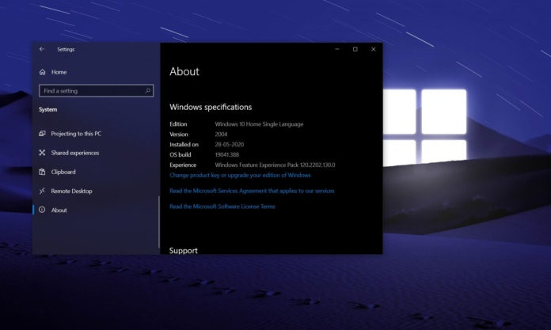

<html>
<head>
</head>
<body>
      

          
<h1>
微软 Win10 20H2 新功能盘点：全新开始菜单，简化升级，Edge 浏览器
</h1>

      
<h3>
作者：it之家
</h3>

          
IT之家7月26日消息 Windows 10即服务每年更新两次，其中包含新功能和改进。Windows 10的下一个更新称为“20H2”，将在2020年下半年登陆。

          
微软表示，Windows 10 20H2或Build 19042将包括“一系列功能”，这意味着这将是另一个较小的更新，没有突破性的变化，就像Windows 10版本1909更新一样。
 
           
          
IT之家获悉，除了微小的变化，Windows 10 20H2还可提供更大的改进，包括带有“主题感知”磁贴的全新“开始”菜单，以及更新的Alt-Tab应用程序切换，支持在Microsoft Edge中打开的选项卡。

     
还有其他各种调整。例如，微软还正在对通知和设置进行调整。此外，计划在全新安装Windows 10时根据你的Microsoft帐户为任务栏填充与用户更相关的图标。

       
对于OEM制造商，微软现在确认Windows 10版本20H2将不会为“Windows硬件兼容性计划”带来更新。换句话说，Windows 10 20H2版本的硬件实验室、驱动程序和系统要求都不会更改。

  
微软表示：“Windows 10版本20H2不会带来Windows硬件兼容计划的更新，并遵循与19H2相同的模式。”

  
这也意味着从当前Windows 10版本2004（20H1）升级到20H2的用户将具有简化的升级过程。用户还将注意到安装过程更快，就像他们正在安装累积更新一样。

  
去年，Windows 10版本1909更新WHCP要求于10月宣布，功能更新于11月发布给消费者。今年的WHCP要求详细说明似乎很早，也表明Windows 10 20H2的发布时间可能比预期的要早。

  
Windows 10 20H2更新将包括新的“开始”菜单，Alt-Tab多任务改进和基于Chromium的Microsoft Edge浏览器。它还将包括Windows 10版本2004的最新累积更新中提供的修复程序。

      
<h4><a href="2.html">上一篇：关于黑苹果安装和配置的总结</a></H4>

 
<h4><a href="4.html">下一篇：不可用</a></H4>

      

</body>
</html>
